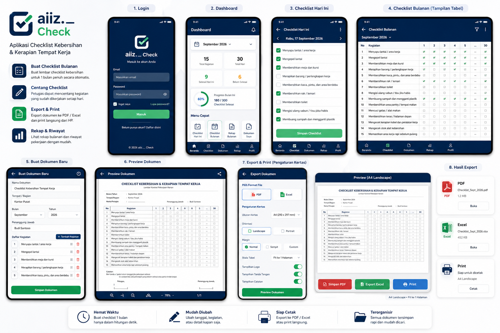
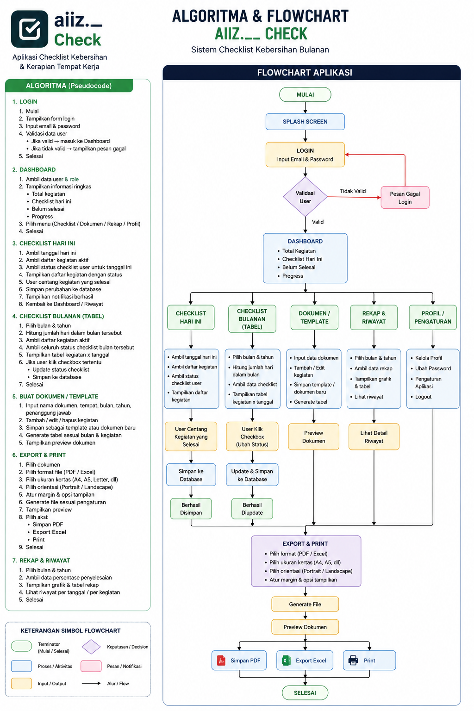

# aiiz.__ Check — Flutter Prototype

Aplikasi checklist kebersihan/kerapian tempat kerja yang bisa diubah langsung dari HP, lalu dibuat menjadi **PDF, Excel, atau diprint**.

## Fitur yang sudah ada

- Splash screen + logo **aiiz.__ Check**.
- Login prototype.
- Dashboard progress checklist.
- Checklist **per hari**.
- Checklist **bulanan dalam tabel tanggal 1–28/29/30/31 otomatis**.
- Tambah, edit, hapus, dan urutkan kegiatan.
- Ubah nama dokumen, tempat/bagian, penanggung jawab, bulan, dan tahun.
- Data disimpan lokal menggunakan `shared_preferences`.
- Preview PDF langsung di aplikasi.
- Export **PDF**.
- Export **Excel (.xlsx)**.
- **Print langsung** lewat printer yang dikenali perangkat.
- Pengaturan export: A4, A5, Letter, Legal, F4/Folio.
- Landscape / Portrait.
- Pengaturan margin.
- Logo.
- Tanda tangan.
- Catatan.
- Mode export **mentahan kosong** atau **dengan centang yang sudah diisi**.
- Rekap progress per tanggal.

## Cara menjalankan project

### 1. Persiapan

Pastikan sudah terinstall:

- Flutter SDK
- VS Code + extension Flutter & Dart
- Android Studio / Android SDK jika ingin menjalankan aplikasi di Android

Cek instalasi Flutter:

```bash
flutter doctor
```

### 2. Setup project

Setelah repository di-clone atau didownload:

1. Buka folder project menggunakan **VS Code**.
2. Pilih menu **Terminal → New Terminal**.
3. Jalankan:

```bash
flutter pub get
```

Jika muncul:

```text
Got dependencies!
```

berarti package project sudah berhasil dipasang.

### 3. Menjalankan aplikasi

Android emulator atau HP:

```bash
flutter run
```

Web Chrome:

```bash
flutter run -d chrome
```

Windows Desktop:

```bash
flutter run -d windows
```

## Login Prototype

Pada versi prototype ini, login masih menggunakan sistem lokal dan belum terhubung ke Firebase Authentication.

Contoh login:

```text
admin@aiizcheck.local
123456
```

## Struktur Project

```text
lib/
├── main.dart
├── app_state.dart
├── models.dart
├── services/
│   ├── export_history_service.dart
│   └── export_service.dart
└── screens/
    ├── login_screen.dart
    ├── dashboard_screen.dart
    ├── checklist_screen.dart
    ├── document_screen.dart
    ├── export_screen.dart
    ├── recap_screen.dart
    └── profile_screen.dart
```

## Aset Project

```text
assets/images/aiiz_check_logo.png
assets/images/app_icon.png
docs/mockup.png
docs/flowchart.png
```

## Tampilan Sistem

### Mockup Aplikasi



### Flowchart Sistem



## Pengembangan Selanjutnya

Beberapa fitur yang dapat dikembangkan:

- Firebase Authentication.
- Cloud Firestore.
- Role Admin / Petugas.
- Foto bukti pekerjaan.
- Tanda tangan digital.
- Riwayat dokumen per bulan.
- Backup cloud.
- Notifikasi jadwal tugas.

## Jika terjadi error package

Jalankan:

```bash
flutter clean
flutter pub get
flutter run
```

Jika versi Flutter terlalu lama:

```bash
flutter upgrade
```
